<!-- BANNER - terminal profile.sh --live -->
<picture>
  <source media="(prefers-color-scheme: dark)"  srcset="assets/banner-dark.v9.svg">
  <source media="(prefers-color-scheme: light)" srcset="assets/banner-light.v9.svg">
  
</picture>

 

<!-- NAME / TAGLINE - animated typing -->

 

<!-- SOCIALS -->
&nbsp;&nbsp;
&nbsp;&nbsp;

 

---

## ⚡ About The Developer

I build secure, scalable systems at the intersection of **Cybersecurity**, **AI**, and dynamic **Web Development**. Whether it's deep-diving into Zero-Knowledge architecture, configuring Linux environments, or designing immersive frontend experiences, I love bringing complex ideas to life.

---

## 🚀 Flagship Initiatives

### 🛡️ PhishGuard ZK (Extension & Web)
A multi-layered phishing detection engine featuring a Zero-Knowledge Browser Extension that neutralizes zero-day threats in real-time.
- 👨‍💻 **Lead Full-Stack Dev:** Naishal Nadiya
- 🎨 **Lead Designer & Partner:** Sruthika Ramawat

### 🌌 Nexus Ecosystem
A collaborative tech initiative focusing on innovative solutions, robust architecture, and next-gen tools.

<table width="100%">
  <tr>
    <td width="50%" valign="top">
      <h3>🌌 Nexus</h3>
      
<em>Status: Live & Deployed</em>

      
A collaborative tech initiative where Sruthika and I will build future projects together. The Nexus platform and website architecture was developed entirely by me.

      <ul>
        <li>👨‍💻 <b>Developer:</b> Naishal Nadiya</li>
      </ul>
       
      
    </td>
    <td width="50%" valign="top">
      <h3>✨ Nexora</h3>
      
<em>Status: Live & Deployed</em>

      
A Socratic AI Learning Tutor built to address UN SDG 4 (Quality Education). It features local storage memory and a decoupled Python/Flask backend.

       
      <ul>
        <li>👨‍💻 <b>Full-Stack Developer:</b> Naishal Nadiya</li>
      </ul>
       
      
    </td>
  </tr>
</table>

---

## 🌐 Web Development & Interactive Portfolios
Crafting unique UI/UX experiences across different themes and functionalities.

<table width="100%">
  <tr>
    <td width="50%" valign="top">
      <h3>👨‍💻 Main Portfolio Website</h3>
      
My central developer portfolio showcasing my skills, projects, and systems architecture experience.

       
      
    </td>
    <td width="50%" valign="top">
      <h3>🖥️ macOS Web Experience</h3>
      
A seamless, high-performance web portfolio replicating the macOS desktop environment to showcase advanced frontend logic.

       
      
    </td>
  </tr>
  <tr>
    <td width="50%" valign="top">
      <h3>📟 Cyber Terminal UI</h3>
      
An immersive command-line interface web portfolio featuring hacker aesthetics. Type commands to explore my skills.

       
      
    </td>
    <td width="50%" valign="top">
      <h3>🌾 Pongal Festival Showcase</h3>
      
A vibrant, culturally inspired website celebrating the Pongal festival with interactive frontend elements and festive design.

       
      
    </td>
  </tr>
  <tr>
    <td width="50%" valign="top">
      <h3>🎵 Sithira Puthiri Cinematic UI</h3>
      
A next-level music experience featuring advanced liquid glassmorphism, precise HTML5 audio seeking logic, and perfectly synchronized LRC lyrics.

      
    </td>
    <td width="50%" valign="top">
      <h3>🎵 Akhiyaan Gulaab Music UI</h3>
      
A custom-built, immersive web music player featuring sleek playback controls, synced lyrics, and cinematic visuals.

       
      
    </td>
  </tr>
</table>

---

## ✍️ Technical Writing & Content
Authoring deep dives into digital security, exposing phishing scams, and discussing vulnerabilities under the handle **naishal988** across Medium, Blogger, and Hashnode.

---

## 🛠️ Core Tech Stack

---

## 🐍 GitHub Contributions

<!-- Note: To make this snake animation work, you will need to set up the snake GitHub Action in your repository (.github/workflows/snake.yml) -->
<picture>
  <source media="(prefers-color-scheme: dark)" srcset="https://raw.githubusercontent.com/naishal988/naishal988/output/github-snake-dark.svg">
  <source media="(prefers-color-scheme: light)" srcset="https://raw.githubusercontent.com/naishal988/naishal988/output/github-snake.svg">
  
</picture>

---

` Built with love · @naishal988 `

